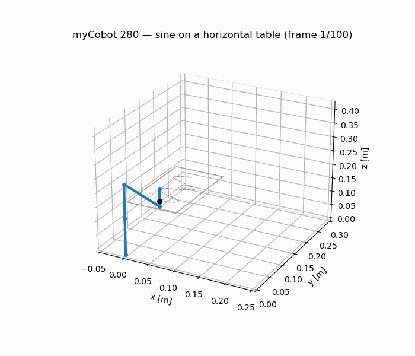
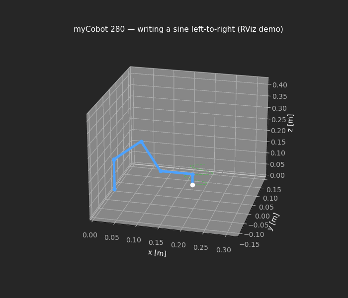

# Robotics Research Portfolio — Abhishek Ray

**Task-constrained manipulation: where a serial arm can work, not merely where it can reach.**

A connected line of work on 6-DOF manipulators, running from verified analytical kinematics,
through a workspace-theoretic study of orientation-constrained tasks, to a clean-sheet arm
designed against that theory.

**Junior Research Fellow, Space Dynamics and Flight Control Laboratory (SDFCL), Department of
Aerospace Engineering, IIT Kanpur.**

*Prepared for research applications. Everything here is reproducible: each result is produced
by a script in the same folder, and every figure regenerates from source.*

---

## Research position

A manipulator's **reachable workspace** — the set of positions the tool centre can occupy —
is the quantity textbooks compute and datasheets quote. It is also, for most real tasks, the
wrong quantity. A task that fixes the tool *orientation* (tracing a surface with the tool
normal to it, inserting a peg, holding a probe on a docking interface) is feasible on a
strictly smaller set, and that set is not a simple subset one can guess from the reachable
volume: it depends on the surface's orientation and it contains holes.

The through-line of this work is to **compute that constrained set, quantify it, and then
design against it** — rather than discovering it at the point where the hardware fails.

---

## 1 · Task-constrained workspace and IK for surface tracing

**Questions.** (Q1) Which tool directions are feasible, where? (Q2) Can a small 6-DOF arm
trace a curve anywhere in its workspace — including on a horizontal table?

**Method.** Modified (Craig) DH kinematics with a velocity-propagation Jacobian; a
feasibility test over a discretised workspace with the tool constrained normal to the
surface; four IK solvers benchmarked from a common seed; Yoshikawa manipulability
`w = √det(Jᵥ Jᵥᵀ)` and condition number `κ = σ_max/σ_min` mapped over the same grid.

**Results.**

| Finding | Result |
| --- | --- |
| Vertical board | Near the base only the **rear** tool direction is feasible; the front direction opens only beyond x ≳ 0.17 m |
| Horizontal table | **63.5 %** of reachable cells permit pen-down tracing — and they form a **ring**, with a dead zone directly above the base |
| Best IK solver | Damped least squares: **98.7 %** success, ~76 iterations, ~15 ms |
| Levenberg–Marquardt | 61 % success, ~10 iterations, ~16 ms — faster and more accurate, less robust |
| Pseudoinverse / Jacobian-transpose | 26 % / 29 % — brittle near singularities, and slow, respectively |
| Manipulability structure | Dead zone above the base, dexterous **ring** at mid-radius, rising κ toward full extension (peak w ≈ 0.0057) |
| Validation | Surfaces placed *using* the analysis trace at **0.000 mm** error, on both a vertical board and a horizontal table |

The dead zone above the base is not a reachability limit — those cells are reachable. It is
a *dexterity* limit, and it is invisible to a reachable-workspace analysis.

→ [`1-task-constrained-workspace-ik/`](1-task-constrained-workspace-ik) ·
[README](1-task-constrained-workspace-ik/README.md) ·
[paper draft](1-task-constrained-workspace-ik/paper/paper.md) ·
[extended write-up](1-task-constrained-workspace-ik/book) ·
[experiments](1-task-constrained-workspace-ik/analysis)

---

## 2 · ARM-450: designing a manipulator against the constrained workspace

A 6-DOF arm designed from a clean sheet, where the *contribution is the verification method*
rather than the arm: an eight-stage gate in which every criterion is recomputed **from the
exported CAD geometry** rather than from the parameters used to author it, with the full load
suite re-run across five payload configurations.

| | |
| --- | --- |
| Envelope / mass | 450.0 mm, 1.365 kg against a 1.450 kg ceiling, 300 g tool payload |
| Reachable workspace | 190 L, no dead zone |
| **Workable** workspace (tool normal, vertical board) | **20 %** — a patch ≈ 95 × 140 mm |
| Trajectory tracking | 240/240 waypoints, 0.014 mm RMS, 0 collisions |
| Verification | 60 pre-print checks, 52 STEP B-rep features audited, 0 outstanding |
| Defects caught pre-print | 13 that survived visual inspection; 3 would have destroyed a print run |

The gap between *190 litres reachable* and *20 % workable* is the same effect quantified in
§1, now measured on a purpose-built arm — which is the argument for computing it at design
time.

The precision analysis is deliberately negative where the evidence is negative: absolute
accuracy is backlash-limited at roughly 5 mm, no structural change fixes it, and the honest
conclusion is that a sub-millimetre docking task needs joint-side encoders. The design
answers that by making the tool tolerant rather than pretending the arm is accurate.

Predictions are recorded **before** hardware exists, with `[AWAITING HARDWARE]` markers where
measurements will go: a prediction recorded before the test is evidence; one recorded after
it is not.

The design is realised in ROS 2 as well as on paper:
[`ros2/arm450_description`](2-arm450-design-study/ros2/arm450_description) carries the
generated URDF and meshes, so the workspace and trajectory claims above can be re-run against
the same model rather than taken on trust.

→ [`2-arm450-design-study/`](2-arm450-design-study) ·
[paper draft](2-arm450-design-study/PAPER.md) ·
[kinematics](2-arm450-design-study/KINEMATICS.md) ·
[workspace analysis](2-arm450-design-study/WORKSPACE.md) ·
[precision budget](2-arm450-design-study/PRECISION.md)

---

## 3 · Verified kinematics foundation

The kinematics every result above rests on, implemented from first principles and verified
before use:

- modified-DH forward kinematics — agrees with the URDF to **~1e-15 m**;
- velocity-propagation Jacobian — agrees with finite differences to **2.5e-7**;
- damped-least-squares IK, cross-validated against an independent library (`ikpy`);
- realised as ROS 2 nodes streaming `/joint_states` at 30 Hz, with a second node
  reconstructing the *achieved* path from TF so target and result are compared, not assumed.

→ [`3-verified-kinematics-foundation/`](3-verified-kinematics-foundation) ·
[verification scripts](3-verified-kinematics-foundation/analysis)

---

## Methods, tools and reproducibility

| | |
| --- | --- |
| Kinematics | Modified/Craig DH, velocity-propagation Jacobian, DLS / pseudoinverse / Jacobian-transpose / Levenberg–Marquardt IK, manipulability and conditioning analysis |
| Simulation | ROS 2 Jazzy, RViz, PyBullet, custom numerical integrators |
| Design & analysis | Parametric CAD in Python, STEP/STL export, FEA, tolerance and compliance budgets |
| Numerics | NumPy, SciPy, matplotlib |
| Practice | Independent cross-validation of every solver; results accepted only when two independent implementations agree; figures regenerated from scripts, never edited by hand |

Each project folder runs standalone: `python3 analysis/<experiment>.py` regenerates its
figures and tables from scratch.

---

## Also ongoing

Further work in free-floating capture dynamics — manipulation from a platform that is not
bolted down, where arm motion reacts on its own base and momentum is conserved — is part of
a team project at SDFCL and is not published here. I am happy to discuss it directly.

---

**Abhishek Ray** · royabhishek4650roy@gmail.com

*Seeking PhD positions in robotic manipulation, workspace analysis, and space robotics.*
