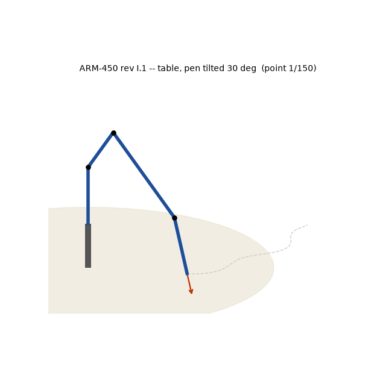

# Robotics Research Portfolio — Abhishek Ray

**Task-constrained manipulation: where a serial arm can work, not merely where it can reach.**

A connected line of work on 6-DOF manipulators, running from verified analytical kinematics,
through a workspace-theoretic study of orientation-constrained tasks, to a clean-sheet arm
designed against that theory.

**Junior Research Fellow, Space Dynamics and Flight Control Laboratory (SDFCL), Department of
Aerospace Engineering, IIT Kanpur.**

*Prepared for research applications. Everything here is reproducible: each result is produced
by a script in the same folder, and every figure regenerates from source.*

---

## Research position

A manipulator's **reachable workspace** — the set of positions the tool centre can occupy —
is the quantity textbooks compute and datasheets quote. It is also, for most real tasks, the
wrong quantity. A task that fixes the tool *orientation* (tracing a surface with the tool
normal to it, inserting a peg, holding a probe on a docking interface) is feasible on a
strictly smaller set, and that set is not a simple subset one can guess from the reachable
volume: it depends on the surface's orientation and it contains holes.

The through-line of this work is to **compute that constrained set, quantify it, and then
design against it** — rather than discovering it at the point where the hardware fails.

---

## 1 · Task-constrained workspace and IK for surface tracing

**Questions.** (Q1) Which tool directions are feasible, where? (Q2) Can a small 6-DOF arm
trace a curve anywhere in its workspace — including on a horizontal table?

**Method.** Modified (Craig) DH kinematics with a velocity-propagation Jacobian; a
feasibility test over a discretised workspace with the tool constrained normal to the
surface; four IK solvers benchmarked from a common seed; Yoshikawa manipulability
`w = √det(Jᵥ Jᵥᵀ)` and condition number `κ = σ_max/σ_min` mapped over the same grid.

**Results.**

| Finding | Result |
| --- | --- |
| Vertical board | Near the base only the **rear** tool direction is feasible; the front direction opens only beyond x ≳ 0.17 m |
| Horizontal table | **63.5 %** of reachable cells permit pen-down tracing — and they form a **ring**, with a dead zone directly above the base |
| Best IK solver | Damped least squares: **98.7 %** success, ~76 iterations, ~15 ms |
| Levenberg–Marquardt | 61 % success, ~10 iterations, ~16 ms — faster and more accurate, less robust |
| Pseudoinverse / Jacobian-transpose | 26 % / 29 % — brittle near singularities, and slow, respectively |
| Manipulability structure | Dead zone above the base, dexterous **ring** at mid-radius, rising κ toward full extension (peak w ≈ 0.0057) |
| Validation | Surfaces placed *using* the analysis trace at **0.000 mm** error, on both a vertical board and a horizontal table |

The dead zone above the base is not a reachability limit — those cells are reachable. It is
a *dexterity* limit, and it is invisible to a reachable-workspace analysis.

→ [`1-task-constrained-workspace-ik/`](1-task-constrained-workspace-ik) ·
[README](1-task-constrained-workspace-ik/README.md) ·
[paper draft](1-task-constrained-workspace-ik/paper/paper.md) ·
[extended write-up](1-task-constrained-workspace-ik/book) ·
[experiments](1-task-constrained-workspace-ik/analysis)

---

## 2 · ARM-450: designing a manipulator against the constrained workspace

*The first design iteration. Its successor, rev I.1, the version sent to the printer, is
analysed in [§4](#4--arm-450-rev-i1-the-drawable-workspace-of-the-as-designed-arm).*

A 6-DOF arm designed from a clean sheet, where the *contribution is the verification method*
rather than the arm: an eight-stage gate in which every criterion is recomputed **from the
exported CAD geometry** rather than from the parameters used to author it, with the full load
suite re-run across five payload configurations.

| | |
| --- | --- |
| Envelope / mass | 450.0 mm, 1.365 kg against a 1.450 kg ceiling, 300 g tool payload |
| Reachable workspace | 190 L, no dead zone |
| **Workable** workspace (tool normal, vertical board) | **20 %** — a patch ≈ 95 × 140 mm |
| Trajectory tracking | 240/240 waypoints, 0.014 mm RMS, 0 collisions |
| Verification | 60 pre-print checks, 52 STEP B-rep features audited, 0 outstanding |
| Defects caught pre-print | 13 that survived visual inspection; 3 would have destroyed a print run |

The gap between *190 litres reachable* and *20 % workable* is the same effect quantified in
§1, now measured on a purpose-built arm — which is the argument for computing it at design
time.

The precision analysis is deliberately negative where the evidence is negative: absolute
accuracy is backlash-limited at roughly 5 mm, no structural change fixes it, and the honest
conclusion is that a sub-millimetre docking task needs joint-side encoders. The design
answers that by making the tool tolerant rather than pretending the arm is accurate.

Predictions are recorded **before** hardware exists, with `[AWAITING HARDWARE]` markers where
measurements will go: a prediction recorded before the test is evidence; one recorded after
it is not.

The design is realised in ROS 2 as well as on paper:
[`ros2/arm450_description`](2-arm450-design-study/ros2/arm450_description) carries the
generated URDF and meshes, so the workspace and trajectory claims above can be re-run against
the same model rather than taken on trust.

→ [`2-arm450-design-study/`](2-arm450-design-study) ·
[paper draft](2-arm450-design-study/PAPER.md) ·
[kinematics](2-arm450-design-study/KINEMATICS.md) ·
[workspace analysis](2-arm450-design-study/WORKSPACE.md) ·
[precision budget](2-arm450-design-study/PRECISION.md)

---

## 3 · Verified kinematics foundation

The kinematics every result above rests on, implemented from first principles and verified
before use:

- modified-DH forward kinematics — agrees with the URDF to **~1e-15 m**;
- velocity-propagation Jacobian — agrees with finite differences to **2.5e-7**;
- damped-least-squares IK, cross-validated against an independent library (`ikpy`);
- realised as ROS 2 nodes streaming `/joint_states` at 30 Hz, with a second node
  reconstructing the *achieved* path from TF so target and result are compared, not assumed.

→ [`3-verified-kinematics-foundation/`](3-verified-kinematics-foundation) ·
[verification scripts](3-verified-kinematics-foundation/analysis)

---

## 4 · ARM-450 rev I.1: the drawable workspace of the as-designed arm

The §1 analysis is repeated on the arm as released for printing, with one change of
discipline: **the kinematic model is derived from the CAD, not from a specification.**

**Method.**

1. The six servo axes are measured on the exported geometry.
2. Modified-DH frames are built on those axes by fixed rules, and the DH table is read back
   from the frames.
3. FK is checked against two independent models:
   - the CAD moved by its own screw axes (product of exponentials; the DH table is never read);
   - the URDF, through `ikpy`.
4. The spherical wrist gives a closed-form Pieper IK with all 8 branches. It is benchmarked
   against DLS, pseudoinverse, Jacobian-transpose, Levenberg–Marquardt and `ikpy`.

**Results.**

| Finding | Result |
| --- | --- |
| Model fidelity | FK = CAD to 3.0e-13 mm and = URDF to 2.6e-13 mm over 2000 poses; velocity-propagation Jacobian = geometric form to 2e-13 |
| Closed form vs iterative IK | Closed form: 100 % of 500 poses, 0.18 ms, no seed. Iterative solvers reach 95–99.8 % from a seed 3° away, but only 18–48 % from the ready pose. They are local methods, suited to tracking a path the closed form has seeded. |
| **Drawable workspace** | **The tool can never point straight down.** The pitch joints J2 + J3 + J5 give at most 54 + 72 + 46.5 = 172.5°. At every table height, 0 % of reachable cells allow a vertical pen. The least workable tilt grows with height, from 15° low down to 90° at z = 350 mm. |
| Vertical board | Only the outward-facing tool works: 0 % at x = 150 mm, 9.7 % at 250 mm, 46 % at 350 mm |
| Singularities | The straight-up home pose is singular three ways (shoulder, elbow, wrist); work starts from a bent ready pose |
| Redundancy in use | A pen is symmetric, so the task is 5-D on a 6-joint arm. Using the free roll in the null space keeps the traced motion smooth through the wrist singularity (largest step < 3°). |
| Timing on the actuators | On a vertical board at half the servo rating, the pen moves at ~82 mm/s. Encoder resolution alone bounds accuracy at ~0.9 mm. |

The §1 point holds in a sharper form. The reachable workspace (405 mm reach, 75 L above the
table) says nothing about the fact that a tool normal to a table is infeasible everywhere.
**On this arm the joint limits, not the link lengths, decide the task workspace.** A
design-time task-workspace check would have caught this before the geometry was frozen.

→ [`4-arm450-rev-i1-kinematics/`](4-arm450-rev-i1-kinematics) ·
[report (PDF)](4-arm450-rev-i1-kinematics/docs/ARM450_KINEMATICS.pdf) ·
[DH table](4-arm450-rev-i1-kinematics/DH_TABLE.md) ·
[analysis scripts](4-arm450-rev-i1-kinematics/analysis) ·
the mechanical release (print files, CAD, verification logs) is in the
[engineering portfolio](https://github.com/Abhishek4650/robotics-engineering-portfolio/tree/main/6-arm450-rev-i1)

---

## Methods, tools and reproducibility

| | |
| --- | --- |
| Kinematics | Modified/Craig DH, velocity-propagation Jacobian, DLS / pseudoinverse / Jacobian-transpose / Levenberg–Marquardt IK, manipulability and conditioning analysis |
| Simulation | ROS 2 Jazzy, RViz, PyBullet, custom numerical integrators |
| Design & analysis | Parametric CAD in Python, STEP/STL export, FEA, tolerance and compliance budgets |
| Numerics | NumPy, SciPy, matplotlib |
| Practice | Independent cross-validation of every solver; results accepted only when two independent implementations agree; figures regenerated from scripts, never edited by hand |

Each project folder runs standalone: `python3 analysis/<experiment>.py` regenerates its
figures and tables from scratch.

---

## Also ongoing

I am a member of the **MASCOT** team at SDFCL. The team works on free-floating capture
dynamics: manipulation from a platform that is not bolted down, where arm motion reacts on
its own base and momentum is conserved. This is team work, so its specifications and
results are not published here. I am happy to discuss my part in it directly.

---

**Abhishek Ray** · royabhishek4650roy@gmail.com

*Seeking PhD positions in robotic manipulation, workspace analysis, and space robotics.*
